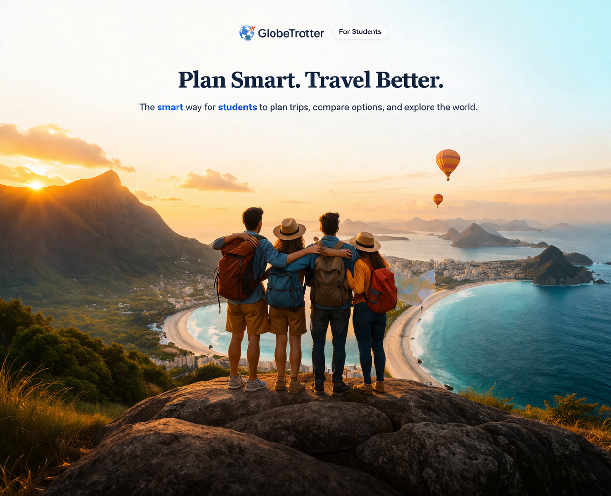

# GlobeTrotter - Smart Student Travel Planner



**Plan Smart. Travel Better.**

GlobeTrotter is a student-centered travel planning platform that simplifies trip planning by bringing essential steps into one unified place. No more switching between multiple websites—compare flights, hotels, events, and coordinate group travel decisions all in one platform.

---

## About the Project

### The Problem
College students face three major challenges when planning trips:
- Constantly switching between multiple platforms (Google Flights, Expedia, Airbnb, etc.)
- Difficulty coordinating group travel with different budgets and preferences
- Planning feels mentally exhausting due to information overload

### Our Solution
GlobeTrotter consolidates travel planning into a single, intuitive platform with:
- Unified dashboard combining flights, hotels, and local events
- Budget management and smart filtering
- Group coordination tools with voting and real-time budget alignment
- Simplified workflows that reduce cognitive load

---

## User Research

We conducted semi-structured interviews with 6 college students to understand their travel planning challenges:

**Key Findings:**
- Budget is the primary decision factor for all students
- Students struggle with platform fragmentation and slow group coordination
- Planning feels overwhelming due to information overload and time constraints
- Less experienced travelers need guidance and reassurance

**User Needs:**
- Single place to compare affordable travel options
- Clear cost and time information
- Support for group coordination
- Simpler steps that reduce planning stress

---

## How It Works

**Simple Task:** Budget Trip Planning  
A student sets a budget, searches for travel options, compares available plans, and saves the best option.

**Moderate Task:** Comparing Travel Options  
Users compare multiple choices and evaluate trade-offs between cost and travel time.

**Complex Task:** Advanced Travel Planning  
Users explore detailed options, coordinate with groups, discover local events, and build complete itineraries.

## Prototypes

**Interactive Prototype:** [View Live Prototype](https://www.figma.com/proto/5uxKhqZDCidc14a410pv4B/GlobeTrotter?node-id=1-2&t=xvJnGQIxld6U18H3-0&scaling=min-zoom&content-scaling=fixed&page-id=0%3A1&starting-point-node-id=1%3A2)

**Design Files:** [View Figma Mockups](https://www.figma.com/design/uEHRxeN1XMnFgGxF1q5PIS/HCI-Moderate-and-Complex?node-id=0-1&p=f)

**Note:** The prototype uses static mock data and simulates interactions. It's designed to demonstrate the user experience and design system, not backend functionality.

---

## Project Information

**Course:** CIS5930 - Human-Computer Interaction  
**Institution:** Florida State University  
**Semester:** Spring 2026  
**Team:** Team 2

---

## Team Members

- **Bharadwaj Manne** 
- **Rasheeq Ishmam** 
- **Arturo Calanche**

---

## Getting Started

### View the Project
1. Visit the [GlobeTrotter website](https://bharadwaj-1953.github.io/GlobeTrotter/)
2. Explore the interactive prototype through the site
3. Review design files in Figma

### Run Locally
```bash
# Clone the repository
git clone https://github.com/bharadwaj-1953/GlobeTrotter.git
cd GlobeTrotter

# Open in browser
open index.html

# Or use a local server
python -m http.server 8000
# Visit http://localhost:8000
```

---

## Project Structure

```
GlobeTrotter/
├── index.html          # Main website
├── style.css           # Styling and responsive design
├── script.js           # Interactive features
├── README.md           # This file
├── Title.png           # Hero image
├── Simple.jpeg         # Simple task storyboard
├── Moderate.jpeg       # Moderate task storyboard
└── Complex.jpeg        # Complex task storyboard
```

---

## Key Features

### For Individual Travelers
- Search and compare flights, hotels, and activities
- Set budget and filter results instantly
- Evaluate trade-offs between cost and time
- Discover local events and build itineraries
- Save and manage multiple trips

### For Group Travel
- Create shared group trips
- Private budget input with shared overlapping range
- Structured voting on destinations
- Real-time participation tracking
- Automatic recalculation when members change


## Feedback & Support

We welcome feedback! Please:
- Open an issue for bug reports or feature suggestions
- Try the prototype and share your experience
- Contact us with questions or comments

---

## License

This is an academic project for Florida State University's HCI course. Free to use for educational and research purposes.

---

## Contact

**Bharadwaj Manne**  
📧 bharadwajmanne.195@gmail.com  
🔗 [LinkedIn](https://linkedin.com/in/bharadwaj-manne-711476249) | [GitHub](https://github.com/Bharadwaj-1953) | [Portfolio](https://bharadwaj.vercel.app)

---

*Last Updated: March 2026*  
*Version: 1.0 - Medium-Fidelity Prototype*
